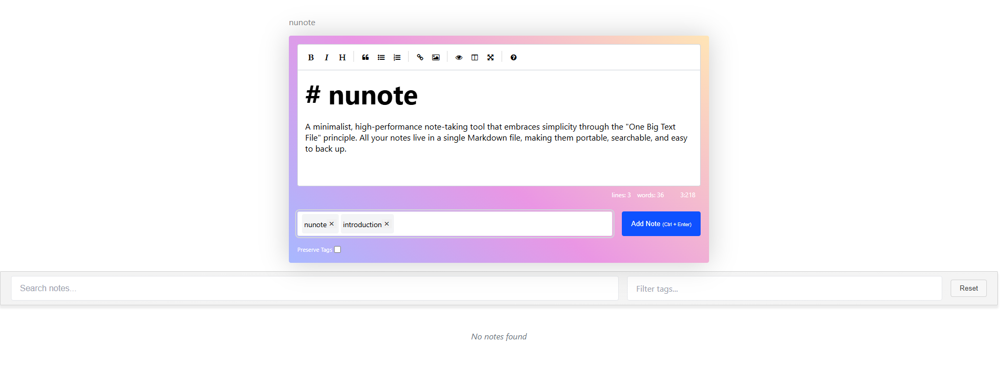

# nunote

A minimalist, high-performance note-taking tool that embraces simplicity through the "One Big Text File" principle. All your notes live in a single Markdown file, making them portable, searchable, and easy to back up.



## Why nunote?

I created nunote because I wanted a note-taking system that stays out of my way while remaining highly efficient. Instead of complex categorization systems or proprietary formats, nunote uses plain Markdown and keeps everything in one file.

Key features:
- Lightning-fast performance (written in Crystal + SolidJS)
- Single binary distribution
- All notes stored in one Markdown file
- Give one or more tags to a note
- Easy to sync with your preferred tools
- Zero configuration required
- Easily search and filter notes

## Prerequisites

- Crystal programming language
- Shards (Crystal's package manager)

## Installation

```bash
git clone https://github.com/danbarbarito/nunote
cd nunote
./install.sh
```

## Usage

```bash
mkdir notes
cd notes
nunote
```

or

```bash
nunote -d /my/notes/directory
```

## File Storage

All notes are stored in `notes.md` in the current or specified directory. This makes it incredibly easy to:
- Back up your notes with your existing tools
- Version control with Git
- Sync across devices
- Edit manually with your favorite text editor
- Import/export without any conversion

## Roadmap

- [ ] Sync support for CouchDB
- [ ] Sync support for Dropbox
- [ ] Full-text search improvements
- [ ] Better support on mobile
- [ ] Images/attachments support
- [ ] "Index" pages where a collection of notes can be added, reordered, etc.

## Contributing

Contributions are welcome! Feel free to submit issues and pull requests.

## License

MIT License

## Why "One Big Text File"?

The "One Big Text File" approach offers several advantages:
- No complex database to maintain
- Easy to search, backup, and version control
- Works with any text editor
- Portable across all platforms
- Simple to sync using existing tools

I believe the best tools are those that do one thing well while remaining simple and maintainable. nunote aims to be exactly that - a fast, reliable note-taking tool that respects your existing workflows.
